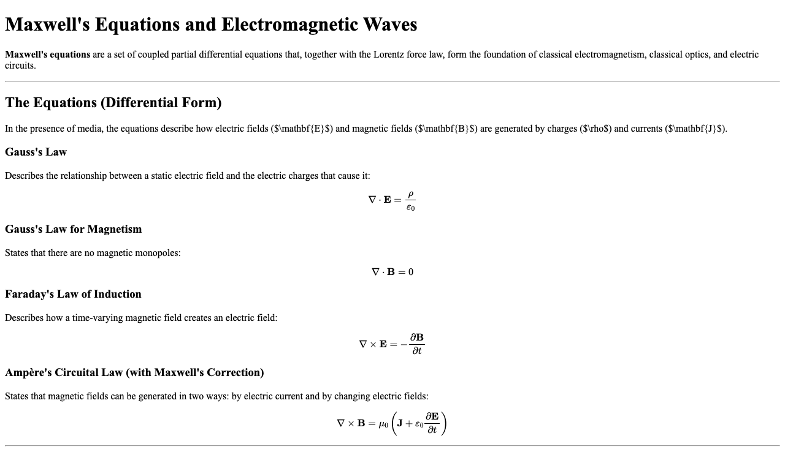

# OmniCast: High-Fidelity Image Renderering for AI Pipelines

OmniCast is a containerized micoservice designed to bridge the gap between human readable technical documentation and Computer Vision AI pipelines. Currently, OmniCast converts structured code and scientific markup (LaTeX + Markdown) into high-resolution visual assets for Multimodal RAG pipelines.

This tool also solves the "Tokenization Limit" problem in LLMs by converting verbose code/math files into visual tokens, allowing Vision-Language Models (like GPT-4o) to analyze without consuming massive context windows

## 🚀 Key Features
* **Universal Rendering:** Transforms Python code and Markdown into pixel-perfect PNGs.
* **Math-Aware:** Uses MathJax to render complex mathematical equations e.g., $$E=mc^2$$
* **Async Code:** Built on FastAPI and Playwright with non blocking browser context management.
* **Containerized:** Fully Dockerized for "One-Line" deployment.

## 🛠️ Architecture
* **Language:** Python 3.10+
* **Framework:** FastAPI (Uvicorn)
* **Engine:** Headless Chromium (Playwright)

## 📸 Examples

**Python Code Rendering:**

**Scientific Math Rendering**
